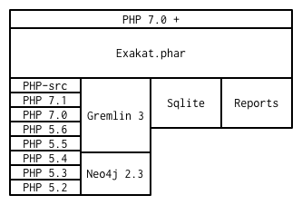

.. _Introduction:

Introduction
============

This is the Exakat engine documentation, version <EXAKAT_VERSION> (Build <EXAKAT_BUILD>), on <DOCUMENTATION_BUILD_DATE>.

What is Exakat ? 
----------------

Exakat is a tool for analyzing, reporting and assessing PHP code source efficiently and systematically. Exakat processes PHP 5.2 to 7.4 code, as well as reporting on security, performance, code quality, migration. 

Exakat reads the code, builds an AST and several dependency graphs, then indexes all of it in a graph database. From there, exakat runs analysis, collecting potential errors and descriptive information about the code. Finally, exakat produces reports, both for humans and machines.

Exakat Use Cases
----------------

Code quality
____________

Exakat detects hundreds of issues in PHP code : dead code, incompatible calls, undefined calls, illogical expressions, etc. Exakat is built for PHP, and cover common mistakes. 

PHP version migration
_____________________

Every PHP middle version is a migration by itself : based on the manual and common practices, exakat find both backward incompatibilities, that prevent migration, and new features, that makes code modern. 

Exakat review code for minor version, and spot bug fixes that may impact the code. 

Framework code quality
______________________

Common best practices and recommendations for specific plat-forms like Wordpress, CakePHP or Zend Framework are covered. 

PHP configurations
__________________

Exakat detects several specialized analyzes, for Web security : making the code more secure online; PHP performances : allowing faster execution.

Security, performances, testability
___________________________________

Exakat has several specialized analyzes, for Web security : making the code more secure online; PHP performances : allowing faster execution; Testability : targeting the common pitfalls that makes code less testable.

Feature inventories
___________________

When auditing code, it is important to have a global view. Exakat collects all PHP features (magic functions, any operator, special functions or patterns) and represents them in one report, giving auditors a full view.

Exakat inventories all literals for later review, helping with the magic number syndrome and any data refactoring. 

Architecture
------------

Exakat relies on PHP to lint and tokenize the target code; a graph database to process the AST and the tokens; a SQLITE 3 database to store the results and produce the various reports.

Exakat itself runs on PHP 7.2, with a short selection of extensions. It is tested with PHP 7.0 and 7.3.

    
Source code is imported into exakat using VCS client, like git, SVN, mercurial, tar, zip, bz2 or even symlink. Only reading access is actually required : the code is never modified in any way. 

At least one version of PHP have to be used, and it may be the same running Exakat. Only one version is used for analysis and it may be different from the running PHP version. For example, exakat may run with PHP 7.2 but audit code with PHP 5.6. Extra versions of PHP are used to provide compilations reports. PHP middle versions may be configured separately. Minor versions are not important, except for edge cases. 

The gremlin server is used to query the source code. Once analyzes are all finished, the results are dumped into a SQLITE database and the graph may be removed. Reports are build from the SQLITE database.
